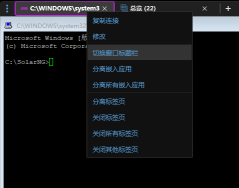
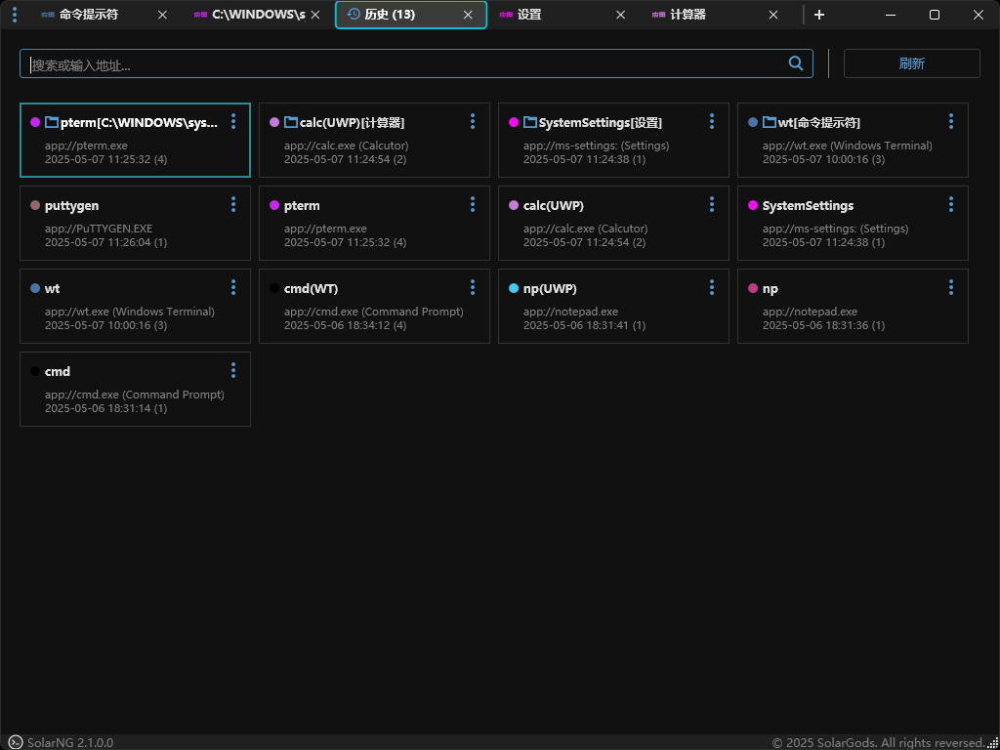

# SolarNG  2.0 使用手册

SolarNG是一个浏览器界面风格的远程管理客户端，还支持标签页化的本地应用管理以及本地应用启动和控制。

SolarNG支持以下远程管理协议:

- Secure Shell (SSH)
- Telnet
- File Transfer Protocol (FTP)
- SSH File Transfer Protocol (SFTP)
- Secure Copy Protocol (SCP)
- Remote Desktop(RDP)
- Virtual Network Computing(VNC)


## 安装需求

| 组件                                 | 版本                           |
| ------------------------------------ | ------------------------------ |
| Windows                      | Windows 7+ (x86/x64)           |
| Microsoft **.NET**                   | .NET Framework 4.5+            |
| PuTTY.exe                            | PuTTY 0.71+/0.77+(通过命名管道传递口令) |
| WinSCP.exe(可选：SFTP/SCP/FTP支持)   | WinSCP 5.9+/5.14+(代理支持)/6.0+(通过命名管道传递口令) |
| tvnviewer.exe(可选：VNC支持)         | TightVNC  2.0+                 |
| PlinkX.exe(可选：代理支持)        | PlinkX 0.79+                  |


## 总览(Overview)标签页

这个界面中可以展示所有的会话列表，会话列表默认按照会话名称来排序(标签始终位于普通会话之前)。通过每个会话右上角的菜单，可以编辑、删除和固定会话。


列表中的每个会话区域显示的内容依次是会话名称、会话类型和会话地址（和非缺省端口）、凭据名称、标签。

如果是本地应用的会话，显示内容依次是会话名称、会话类型和EXE文件名（和显示名称）、应用的命令行、标签。

如果是标签，显示内容依次是标签名称、会话类型、标签包含会话的数量、标签。双击进入该标签的所有会话列表。双击".."可以返回上一级。


### 搜索框功能

输入搜索内容后，当搜索列表不为空时，直接回车就可以打开第一个会话。

当搜索列表为空时，直接回车可以快速新建会话并打开(默认不保存快速新建的会话，可以通过配置项GUI.AutoSaveQuickNew启用自动保存)，具体规则如下：

[type:]\[username[:password]@]address[:port]

type类型有ssh/s, telnet/t, sftp/sf, scp/sc, ftp/f, rdp/r, vnc/v, app/a。不带type类型缺省是SSH会话。

例如：

- 192.168.1.5 - 创建SSH会话，并连接"192.168.1.5:22"的SSH服务。

- telnet:192.168.1.5 – 创建Telnet会话，并连接"192.168.1.5:23"的Telnet服务。

- admin&#64;server.com:8888 – 创建SSH会话和用户名为"admin"的凭据配置，并连接"server.com:8888"的SSH服务。

- a:cmd - 创建本地应用会话，并在标签页中打开cmd应用。

### 新建会话

  提供多种新建会话的途径：

  - 通过总览标签页中的搜索框快速新建会话。

  - 点击总览标签页中的“新建会话”按钮，当搜索框有内容时，会直接使用已有的内容填充新会话，规则与快速新建会话一致。

  - 打开设置标签页中的会话设置，点击“新建”按钮。

  - 点击主菜单里的“新建会话”菜单项。

  - 快捷键Ctrl-E进入新建会话界面。

### 应用控制

SolarNG对于嵌入标签页的PuTTY, WinSCP, MSTSC, tvnviewer等等其他应用支持"切换窗口标题栏"，"分离嵌入应用"的功能。在标签页上点击鼠标右键即可使用这些功能。"切换窗口标题栏"可以让嵌入的应用主窗口显示/关闭原始的标题栏信息，这样就能够操作主窗口系统菜单的功能(对于UWP程序无效)。"分离嵌入应用"(Kick)功能可以让嵌入标签页的应用窗口不再嵌入，关闭SolarNG程序也不会自动关闭已经分离的应用。注意"分离嵌入应用"与"分离标签页"不同，"分离标签页"是把指定的标签页移动到SolarNG的新窗口。



## 历史(History)标签页

主菜单可以进入历史标签页，会话类别始终按打开时间排序。除了打开过的会话列表，还可以显示当前所有打开的标签页会话信息(名称前面会有标签页图标)。



列表中的每个会话区域显示的内容依次是会话名称(和当前标签页名称，位于中括号中)、会话类型和会话地址（和非缺省端口）、最近一次打开时间和打开次数。

搜索框可以搜索，但不能新建会话。双击已打开的会话，会跳转到对应的标签页。双击历史会话，可以打开新会话。对于使用了标题栏同步功能的标签页名字可能实时变化，点击刷新按钮就能看到最新的标签页名字。会话右上角的菜单目前只有一个编辑功能。

## 快捷方式(Shortcut)标签页

这个界面默认遍历开始菜单目录(用户/公共)、桌面目录(用户/公共)、快速启动目录(用户)下的所有快捷方式文件(.lnk)。快捷方式列表不会保存，每次打开这个标签页都需要遍历快捷方式文件。双击某个快捷方式就是启动快捷方式(并不会嵌入到标签页中。如果想嵌入标签页启动，需要点"编辑"菜单创建应用会话)。可以通过"刷新"按钮来更新相应目录的快捷方式文件列表。

列表中的每个快捷方式区域显示的内容依次是快捷方式名称、快捷方式文件全路径、命令行。


## 进程(Process)标签页

这个界面可以列举当前正在运行有主窗口的进程列表。双击某个进程就可以把这个进程的窗口嵌入到标签页中。可以通过"刷新"按钮来更新列表中的进程数据。

进程标签页和窗口标签页全局只能有一个。也就是打开了进程标签页，就无法打开窗口标签页。

列表中的每个进程区域显示的内容依次是进程名称(进程ID)、主窗口类名、主窗口标题。

## 窗口(Window)标签页

这个界面可以列举当前桌面所有主窗口(父窗口是桌面)。双击某个窗口就可以把这个窗口嵌入到标签页中。与进程标签页不同，为了更好的标识窗口，默认标签页名称为窗口的标题栏信息(目前不会根据窗口标题栏内容变化来刷新标签页名称)。可以通过"刷新"按钮来更新列表中的窗口数据。

窗口标签页和进程标签页全局只能有一个。也就是打开了窗口标签页，就无法打开进程标签页。

列表中的每个窗口区域显示的内容依次是窗口ID(进程名称+进程ID+窗口句柄)、主窗口类名、主窗口标题。

## SSH连接复用

SSH服务允许一个TCP连接创建多个SSH会话（最大会话数量由sshd_config的MaxSessions控制，缺省是10）。使用SSH连接复用的好处在于对于不保存登录密码的会话打开多个时无需再次输入密码，坏处是有最大会话数量的限制。SolarNG会自动识别PuTTY的主连接（不能启用PuTTY的UserNameFromEnvironment设置，否则无法自动识别），根据是否存在主连接来判定是否自动输入凭据信息。PuTTY判断是否存在主连接的逻辑（不启用UserNameFromEnvironment设置）：当配置中不包含用户名时，使用主机名、端口号和当前Windows的用户作为标识；当配置中包含用户名时，使用用户名、主机名、端口号和当前Windows的用户作为标识。

### 严格SSH连接复用

SolarNG.cfg中有一个PuTTY.StrictSSHv2Share配置，缺省是false，也就是不启用严格SSH连接复用。启用严格SSH连接复用后，要求主连接必须是在标签页中并且只有一个会话配置有效。否则即便设置为连接复用，也不会使用连接复用功能。举个例子来说明这个问题：有会话A和会话B，两个会话配置都是连接2.2.2.2:22端口，配置的用户名都是root，而且都启用了SSH连接复用功能。当不启用严格SSH连接复用时，如果先打开会话A，那么打开会话B时，会话B即可复用会话A的连接。当启用严格SSH连接复用，先打开会话A后，打开会话B，会话B不会使用SSH连接复用功能，也就是谁先打开，谁才能使用SSH连接复用功能。引入这个配置，主要是解决走不同SSH代理的会话。例如：有会话A、会话B、会话C、会话D，其中会话A和会话B的连接地址、端口和用户名是一样的，并且都启用了SSH连接复用功能。但会话B设置了会话C作为SSH代理而会话A没有设置SSH代理。会话D设置了会话B作为SSH代理。当不启用严格SSH连接复用时，如果先打开了会话A，那么打开会话D，会自动复用会话A连接。也就是访问D的站点实际上只走了一个代理地址，并没有走会话C。只有启用严格SSH连接复用后，先打开会话A，再打开会话D，仍然保持先走会话C的代理，再走会话B的代理。只有会话B作为主连接之后，会话D的SSH代理才启用SSH连接复用功能。需要指出的是，作为代理使用的会话，不会作为SSH连接复用的主连接。

### 推荐使用模式

当已经设置了用户名和密码的会话无需启用SSH连接复用功能，无论是直连还是作为SSH代理，都不需要人工输入登录信息。如果没设置用户名和密码，推荐启用SSH连接复用功能。当这个会话作为SSH代理时，先要打开这个会话作为主连接。之后其他会话使用该代理都不需要再次输入用户名或者密码，而且不受MaxSessions的限制。

## 代理

SolarNG支持多级SOCK4/SOCK5/HTTP/SSH代理功能(依赖PlinkX.exe程序)。其中包含会话集成模式和独立代理模式。

### 会话集成模式

用于会话集成模式的代理配置，只需要配置代理的地址和端口还有相应的凭据信息即可。SOCK4/SOCK5/HTTP代理如果有认证的话，必须要设置完整的凭据信息，否则无法正常使用。SSH会话可以直接做代理，但必须带有凭据信息(可以不带密码，用户名和私钥文件必须指定)。当某个SSH会话作为代理，并且不带密码时，SolarNG会使用自己的界面来输入密码，不过要求必须一次性输入正确，没有错误重试的机会。**作为代理的SSH会话必须要用PuTTY正常访问一次并且保存服务端的公钥指纹信息，否则代理将会无法使用。** 连接SSH代理会自动识别是否存在SSH连接复用的主连接，如果存在，会直接使用SSH连接复用功能。

针对不同协议，代理通道也分如下两种：

#### 标准输入输出代理通道

对于SSH/SFTP/SCP协议的会话来说，可以通过程序的标准输入输出来实现代理通道。这种方式使用起来完全透明，也无需担心本地监听端口的潜在冲突。

#### 本地端口转发代理通道

本地端口转发方式则更加通用，尤其是针对不支持类似SOCKS5等标准代理协议的应用。RDP/VNC/FTP协议将使用这种代理通道。SolarNG根据会话Id和代理会话Id共同计算一个127.0.0.0/8网段的本地地址和端口。只要这两个Id不变，本地地址和端口就不会变（如果计算出来的本地地址和端口被占用，就会递增端口号，当然遇到这种情况的机率非常低）。RDP/VNC/FTP的应用程序连接的是这个本地址，而非远程地址。与标准输入输出代理通道不同的是，用于端口转发的代理进程不会因为关闭会话而自动退出（SolarNG会自动判断相应的代理进程是否启动）。通过SolarNG.cfg中的PlinkX.IdleTimeout配置可以设置自动退出的无连接超时时间(这个时间的设置不宜过小，因为MSTSC连RDP需要登录时，此时是未连接状态。如果输入用户名和密码的时间比较长，就可能发生代理进程已经退出从而连不上的问题)。需要指出的是，由于FTP的数据通道是动态建立的，因此无法使用代理。FTP只能通过代理浏览目录。由于IPv6的loopback地址只有一个，因此无法使用本地地址的随机化功能，想使用IPv6协议的，请关闭PlinkX.RandomLoopbackAddress功能。

### 独立代理模式

用于独立代理模式的代理配置，还需要配置本地监听地址和端口和远程地址和端口信息。对于SSH代理，如果不配置远程地址和端口，则会启用SOCKS5代理模式。如果配置了远程地址和端口，那么则启用端口转发模式。独立代理模式主要用于非SolarNG管控的网络应用程序。需要注意，启动独立的SSH代理仍然使用PuTTY主程序，但由于当前版本无法在命令行中指定监听端口的协议类型(PlinkX已经解决了这个问题)，因此当监听地址是非Loopback地址时，可能会造成监听端口的不受限访问。举个例子来说明这个问题。如果本地配置了多个IPv4地址和一个IPv6的地址，当监听端口和某个IPv4地址绑定时，使用其他的IPv4地址做目的地址是无法访问这个端口的，但PuTTY同时还监听了全0的IPv6地址，也就是说使用IPv6地址也可以访问这个端口。

## 导入和导出会话数据

导出会话数据直接导出不加密的json格式的数据。使用者负责保证包含登录密码的安全性。

导入会话数据也只允许导入不加密的json格式的数据。

### 自动导入注册表中的PuTTY会话

当SolarNG自身的会话数据为空时，会从注册表中自动导入PuTTY已经保存的会话。

### 会话数据加密保护

会话数据只有一种加密方式，即主密码加密。密码加密的算法采用Argon2d + 256位Salt + AES256-GCM。如果不启用主密码，会话数据会压缩存储，也无法直接看到明文数据。

## 主密码(MasterPassword)功能

为了使用方便，SolarNG缺省没有启用主密码功能，请在SolarNG.cfg中修改MasterPassword配置来启用。启用主密码功能后，每次运行SolarNG都会提示输入主密码。如果是第一次运行，会提示输入新的主密码。启用主密码功能后，如果导出会话数据，必须再次输入主密码才能进行导出。当前只有SolarNG.dat会被主密码加密，SolarNG.his不会被加密。由于当前版本SolarNG不支持在界面上修改SolarNG.cfg配置，因此想要修改主密码必须要先禁用主密码功能，然后再启用主密码功能来更换主密码。**需要注意的是，为了防止数据损坏，SolarNG保存SolarNG.dat时，会创建旧SolarNG.dat的备份文件SolarNG.dat.bak。当第一次启用主密码功能后，SolarNG.dat.bak是不加密状态，当确认新SolarNG.dat数据没有损坏后，请及时删除不加密的SolarNG.dat.bak文件。**

## 设置(Settings)标签页

点击主菜单中的"设置"菜单项、快捷键Ctrl+S、新建会话都可以进入设置标签页。

设置标签页全局只能有一个。

### 会话(Sessions)管理

允许新建，修改，删除会话。支持批量修改和删除。

### 凭据(Credentials)管理

凭据管理用于专门设置登录的用户名、密码或者私钥数据的相关配置。一个凭据配置可以用于多个会话。支持批量修改和删除。

### 配置文件(ConfigFiles)管理

配置文件管理用于某些应用有更多的配置信息采用文件方式指定，目前支持的类型包括PuTTY的私钥、PuTTY的脚本、PuTTY会话配置、MSTSC的.rdp配置文件和WinSCP.ini配置文件。支持批量修改和删除。

### 标签(Tags)管理

标签用于会话数据的分组，可以使用搜索标签名的方式快速找到相应分组的会话。支持多级标签，但不能嵌套。支持批量修改和删除。

### 代理(Proxies)管理

允许新建，修改，删除代理数据。支持批量修改和删除。SSH类型的代理只用于独立代理模式。

### 本地应用(Applications)管理

允许新建，修改，删除本地应用。支持批量修改和删除。

### 其他设置

包括快捷键启用/禁用和立即保存所有会话数据。需要指出的是，这里的启用禁用是临时的，下次启动主程序可能会变化。持久性设置在SolarNG.cfg配置里。

## Windows集成

对于正在使用的SolarNG，在Windows任务栏的SolarNG图标上点击鼠标右键，可以看到前10个最常使用的会话，通过这个链接也可以快速打开会话。

## SolarNG快捷键

| **快捷键**     | **功能**               |
| -------------- | ---------------------- |
| CTRL+T         | 新建标签页             |
| CTRL+H         | 打开历史标签页         |
| CTRL+L         | 打开快捷方式标签页     |
| CTRL+N         | 新建窗口               |
| CTRL+E         | 新建会话               |
| CTRL+S         | 打开设置               |
| CTRL+F5        | 重新连接目标地址       |
| CTRL+W         | 关闭当前标签页         |
| CTRL+SHIFT+T   | 打开上一个关闭的标签页 |
| CTRL+TAB       | 切换标签页（从左到右） |
| CTRL+SHIFT+TAB | 切换标签页（从右到左） |
| CTRL+1-8       | 切换到指定标签页       |
| CTRL+9         | 切换到最后一个标签页   |
| CTRL + ←       | 向左移动标签页         |
| CTRL + →       | 向右移动标签页         |
| ALT+F4         | 关闭当前窗口           |

 

## SolarNG.exe.config文件说明

```xml
<?xml version="1.0" encoding="utf-8"?>
<configuration>
  <configSections>
    <section name="log4net" type="log4net.Config.Log4NetConfigurationSectionHandler,SolarNG" />
  </configSections>
  <appSettings>
    <add key="DataFilePath" value="" />
  </appSettings>
  <log4net>
    <root>
      <level value="ERROR" />
      <appender-ref ref="RollingFileAppender" />
    </root>
    <appender name="RollingFileAppender" type="log4net.Appender.RollingFileAppender">
      <file value="SolarNG.log" />
      <appendToFile value="true" />
      <rollingStyle value="Size" />
      <maxSizeRollBackups value="10" />
      <maximumFileSize value="1MB" />
      <staticLogFileName value="false" />
      <LockingModel value="log4net.Appender.FileAppender+MinimalLock" />
      <immediateFlush value="true" />
      <layout type="log4net.Layout.PatternLayout">
        <conversionPattern value="%date [%property{pid}-%thread] %-5level [%logger.%M] - %message%newline" />
      </layout>
    </appender>
  </log4net>
  <startup>
    <supportedRuntime version="v4.0" sku=".NETFramework,Version=v4.5" />
  </startup>
</configuration>
```

appSettings中的配置：

| 配置项名称   | 配置项说明                                                   | 缺省值 |
| ------------ | ------------------------------------------------------------ | ------ |
| DataFilePath | 数据文件存放的目录。数据文件包括SolarNG.cfg文件、会话配置文件、SSH的日志文件和临时文件等在运行过程中创建的文件（不包括SolarNG.log(自身日志)文件，其路径配置在<log4net>中可修改）。如果值是相对路径，则相对主程序所在的路径。 | ""     |

需要指出的是由于代码优化，去掉了log4net里的很多Appender，因此仅保证本地文件日志功能正常，其他方式的日志请结合代码来确认是否支持。

##  SolarNG.cfg文件说明

```json
{
    "Version": 2,
    "MasterPassword": false,
    "ShortcutsLocations": {
        "CommonStartMenu": "%ALLUSERSPROFILE%\\Microsoft\\Windows\\Start Menu\\Programs",
        "StartMenu": "%APPDATA%\\Microsoft\\Windows\\Start Menu\\Programs",
        "CommonDesktop": "%PUBLIC%\\Desktop",
        "Desktop": "%USERPROFILE%\\Desktop",
        "QuickLaunch": "%APPDATA%\\Microsoft\\Internet Explorer\\Quick Launch"
    },
    "GUI": {
        "Language": "",
        "Theme": "",      
        "Logo": true,
        "Hotkey": true,
        "ConfirmClosingTab" : false,
        "ConfirmClosingWindow": true,
        "RandomColor": true,
        "MaximizedBorderThickness": 8,
        "Width": 1024,
        "Height": 768,
        "MinWidthScale": 0.53333,
        "Monitor": "",        
        "WindowStyleMask": 12845056,
        "OverviewOrderBy": "Name",
        "AutoSaveQuickNew": false,
        "AutoCloseOverview": true,
        "WaitTimeout": 50,
        "CloseIME" : true,
        "ExcludeClasses": [
            "Shell_TrayWnd",
            "Windows.UI.Core.CoreWindow",
            "NarratorHelperWindow",
            "ThumbnailDeviceHelperWnd",
            "WorkerW"
        ],
        "ExcludeShortcuts": [
            "SolarNG",
            "unins"
        ]
    },
    "PuTTY": {
        "SSHPasswordByPipe": true,
        "SSHPasswordByHook": false,
        "Path": "%curdir%\\%arch%\\PUTTY.EXE",
        "ClassName": [
            "PuTTY"
        ],
        "AuthClassName": [
            "PuTTY"
        ],
        "CommandLine": "%% -a -noagent",
        "iFlags": 208,
        "UsePipe": true,
        "UseHook": true,
        "HookDll": "PuTTYX",
        "Config": [
            "ScrollBarFullScreen=1",
            "ProxyLocalhost=1"
        ]
    },
    "MSTSC": {
        "FullScreen": [
            "/f",
            "/fullscreen",
            "/span",
            "/multimon"
        ],
        "Path": "%windir%\\%sysnative%\\mstsc.exe",
        "ClassName": [
            "TscShellContainerClass"
        ],
        "Args": "/v:%host:%port /w:%width /h:%height",
        "CommandLine": "%%",
        "iFlags": 448,
        "Flags": [
            "mstsc"
        ],
        "UsePipe": true,
        "UseHook": true,
        "HookDll": "MSTSCX"
    },
    "WinSCP": {
        "PasswordByPipe": true,
        "Arch": "x86",
        "Path": "%curdir%\\%arch%\\WinSCP.exe",
        "ClassName": [
            "TScpCommanderForm",
            "TScpExplorerForm"
        ],
        "AuthClassName": [
            "TAuthenticateForm"
        ],
        "CommandLine": "%% /rawconfig Interface\\Updates\\ShowOnStartup=0 Interface\\ConfirmClosingSession=0 Interface\\Commander\\SessionsTabs=0 Interface\\Explorer\\SessionsTabs=0 Interface\\ExternalSessionInExistingInstance=0",
        "WorkingDir": "%datadir%\\Temp\\",        
        "iFlags": 192,
        "Flags": [
            "winscp"
        ],
        "UsePipe": true,
        "UseHook": true,
        "HookDll": "WinSCPX"
    },
    "VNCViewer": {
        "Path": "%curdir%\\%arch%\\tvnviewer.exe",
        "ClassName": [
            "TvnWindowClass"
        ],
        "AuthClassName": [
            "#32770"
        ],
        "Args": "%host::%port",
        "CommandLine": "%%",
        "iFlags": 448
    },
    "PlinkX": {
        "IdleTimeout": 600,
        "RandomLoopbackAddress": true,
        "CreateNoWindow": true,
        "Arch": "x86",
        "Path": "%curdir%\\%arch%\\plinkx.exe",
        "CommandLine": "%% -a -noagent -proxy-localhost -no-antispoof"
    },
    "ExeLoader": {
        "Path": "%curdir%\\%arch%\\ExeLoader.exe"
    },
    "Notepad": {
        "Path": "%windir%\\%sysnative%\\notepad.exe"
    }
}
```


| 配置项名称                   | 配置项说明                                                   | 缺省值                                      |
| ---------------------------- | ------------------------------------------------------------ | ------------------------------------------- |
| MasterPassword               | 启用主密码功能。"true"是启用，"false"是禁用。                | false                                       |
| ShortcutsLocations           | 获取快捷方式文件的目录。                                     | "CommonStartMenu": ...                      |
| GUI.Language                 | 界面语言设置。"zh-cn"是简体中文，""是自动根据系统的缺省语言来设置，其他值是英文。 | ""                                          |
| GUI.Theme                    | 界面配色设置。"dark"是黑暗配色，""是自动根据系统的配色来设置，其他值是明亮配色。 | ""                                          |
| GUI.Logo                     | 显示主窗口下面的Logo栏（主要用于调整主窗口大小）。"true"是启用，"false"是禁用。主窗口最大化时始终不显示Logo栏。 | true                                        |
| GUI.Hotkey                   | 启用快捷键功能。"true"是启用，"false"是禁用。                | true                                        |
| GUI.RandomColor              | 启用设置随机颜色功能。"true"是启用，"false"是禁用。          | true                                        |
| GUI.ConfirmClosingTab        | 启用关闭会话标签页确认框。"true"是启用，"false"是禁用。      | false                                       |
| GUI.ConfirmClosingWindow     | 启用关闭主窗口确认框。"true"是启用，"false"是禁用。当主窗口至少存在一个会话标签页时，关闭主窗口就会有确认框。 | true                                        |
| GUI.Maximized                | 启用主窗口初始最大化功能。"true"是启用，"false"是禁用。      | false                                       |
| GUI.Width                    | 主窗口初始宽度设置。                                         | 1024                                        |
| GUI.Height                   | 主窗口初始高度设置。                                         | 768                                         |
| GUI.MinWidthScale            | 主窗口初始宽度和屏幕宽度的最小比例设置。                     | 0.53333                                     |
| GUI.Monitor                  | 主窗口初始启动所在的显示器编号。""是默认显示器（由操作系统决定）。"*"是使用主显示器。显示器编号从0开始（可以使用"mstsc.exe /l"来查看编号）。当值大于显示器个数时，使用最后一个显示器。注意这个设置是字符串类型，显示器编号要加引号。 | ""                                          |
| GUI.MaximizedBorderThickness | 主窗口最大化时边框的厚度（用于解决WPF窗口最大化时窗口的宽度和高度超出屏幕大小的问题）。 | 8                                           |
| GUI.WindowStyleMask          | 嵌入标签页中的应用窗口风格属性值的掩码。                     | 12845056 (0x00C40000)                       |
| GUI.AutoSaveQuickNew         | 启用自动保存通过总览标签页中搜索栏快速新建的会话。"true"是启用，"false"是禁用。 | false                                       |
| GUI.AutoCloseOverview        | 启用从总览标签页中打开会话后是否自动关闭总览标签页。"true"是启用，"false"是禁用。 | true                                        |
| GUI.WaitTimeout              | 等待窗口同步的超时时间。单位是100ms。                        | 50                                          |
| GUI.CloseIME                 | 启用主窗口启动后关闭输入法。"true"是启用，"false"是禁用。    | true                                        |
| GUI.ExcludeClasses           | 进程标签页和窗口标签页枚举时排除的窗口类名称。               | "Shell_TrayWnd", ...                        |
| GUI.ExcludeShortcuts         | 遍历快捷方式文件时排除的文件名称(包括目标文件路径，采用子串匹配，大小写不敏感)。 | "SolarNG", "unins"                          |
| GUI.OverviewOrderBy          | 总览标签页中会话列表的排序方法，目前支持"Name"（按会话名排序）、"Counter"（按打开次数排序）和"OpenTime"（按打开会话时间）。 | Name                                        |
| PuTTY.StrictSSHv2Share       | 启用严格SSH连接复用模式。"true"是启用，"false"是禁用。       | false                                       |
| PuTTY.SSHPasswordByPipe      | 启用通过命名管道来传递SSH的口令(不包括私钥证书的口令)。"true"是启用(PuTTY.UsePipe必须也是"true")，"false"是禁用。此功能需要PuTTY 0.77以上版本。 | true                                        |
| PuTTY.SSHPasswordByHook      | 启用通过Hook来传递SSH的口令(包括私钥证书的口令)。"true"是启用(PuTTY.UseHook必须也是"true")，"false"是禁用。此功能属于实验性功能，仅在PuTTY 0.77至0.83版本测试过，不保证支持将来版本。 | false                                       |
| PuTTY.UsePipe                | 启用通过命名管道传递数据(包括口令和私钥文件)。"true"是启用，"false"是禁用。 | true                                        |
| PuTTY.UseHook                | 启用Hook功能。"true"是启用(ExeLoader和PuTTY.HookDll文件必须存在)，"false"是禁用。 | true                                        |
| PuTTY.Config                 | 修改PuTTY的缺省配置。必须启用Hook功能，此配置修改才会生效。  | "ScrollBarFullScreen=1", "ProxyLocalhost=1" |
| MSTSC.UsePipe                | 启用通过命名管道传递配置文件。"true"是启用(MSTSC.UseHook必须也是"true")，"false"是禁用。 | true                                        |
| MSTSC.UseHook                | 启用Hook功能。"true"是启用(ExeLoader和MSTSC.HookDll文件必须存在)，"false"是禁用。 | true                                        |
| WinSCP.PasswordByPipe        | 启用通过命名管道传递口令(包括FTP和私钥证书的口令)。"true"是启用(WinSCP.UsePipe必须也是"true")，"false"是禁用。此功能需要WinSCP 6.0以上版本。 | true                                        |
| WinSCP.UsePipe               | 启用通过命名管道传递数据(包括口令和私钥文件)。"true"是启用，"false"是禁用。由于WinSCP的配置文件还保存SSH服务端的指纹信息，因此不宜使用命名管道方式传递。 | true                                        |
| WinSCP.UseHook               | 启用Hook功能。"true"是启用(ExeLoader和WinSCP.HookDll文件必须存在)，"false"是禁用。 | true                                        |
| PlinkX.IdleTimeout           | 通过本地地址转发的代理程序自动退出的无连接超时时间。单位为秒。如果值为0，则表示代理程序不会自动退出，需要人为杀进程。 | 600                                         |
| PlinkX.RandomLoopbackAddress | 启用本地地址转发的监听地址随机化。"true"是启用，"false"是禁用。由于IPv6的本机地址只有一个地址::1，因此启用这个功能只能用IPv4的协议。如果想使用IPv6的协议，必须禁用此配置(带来的问题是每个会话对应的本地转发地址端口的唯一性有所降低)。 | true                                        |
| PlinkX.CreateNoWindow        | 启用自动创建的本地地址转发进程不显示窗口。"true"是启用，"false"是禁用。打开"proxy"类型的会话不受这个配置影响。 | true                                        |

其他配置仅供专业人士修改。

## RemoteApp模式说明

RemoteApp的窗口是mstsc通过DCOM接口让一个类似服务的mstsc进程创建，SolarNG无法自动捕获其窗口。虽然可以使用窗口标签页把RemoteApp的窗口放到标签页中，但是由于RemoteApp的某种特殊机制，鼠标指针的位置会发生位移，无法正常使用鼠标对RemoteApp进行操作。

RemoteApp模式下，不支持使用命名管道传递.rdp文件，不支持远程应用 Windows 组合键。

进入RemoteApp模式后，本地任务栏的系统托盘会出现远程的系统托盘图标，但不是所有的远程系统托盘图标都能出现。

当RemoteApp模式和普通的远程桌面模式交替使用时，由于两者使用的Windows会话不同，因此即便同一个用户的RemoteApp窗口和普通远程桌面中的窗口之间互相隔离，也就是互相看不到。例如Edge默认会启用“启动增强”功能，这个功能是在用户登录后，Edge后台进程会自动运行，用来提升新开Edge窗口的速度。但如果先进入普通的远程桌面模式后不登出用户而是直接关闭，再进入RemoteApp模式，打开Edge，会看不到Edge的主窗口。要想解决这个问题，要么禁用Edge的“启动增强”和关闭后继续运行的功能，要么切换模式的时候先登出用户。

文件资源管理器在RemoteApp模式下，新建、删除、重命名、复制文件或目录时，文件列表可能不会自动刷新，需要手动刷新才能看到变化。

## SolarNGX.dll模块功能说明

2.0版本引入native模块来提供如下功能：

- 获取其他进程的环境变量(主要是支持32位进程读取64位进程环境变量的功能)，移除之前的.NET组件Gapotchenko.FX.Diagnostics.Process。
- 创建命名管道服务端。
- 主密钥加密算法支持，比.NET代码实现效率更高。

## Hook功能说明

为了解决一些特殊功能需求，SolarNG采用ExeLoader.exe和*X.dll模块来实现hook功能。

### PuTTY(PuTTYX.dll) Hook功能说明

- 解决用命名管道传递私钥文件时，减少命名管道句柄的使用(从4个降低到1个)。还解决了当私钥口令有错误，再次输入时无法找到私钥文件的问题。
- 支持PuTTY配置修改。由于PuTTY配置都是存储于注册表中，命令行下无法修改大多数注册表中的配置。因此通过Hook注册表相关的API来提供每次启动修改配置的能力。
- 支持通过PuTTY内部接口传递口令(实验功能)。由于内部接口的变化可能很大，不保证未来版本的兼容性。

### MSTSC(MSTSCX.dll) Hook功能说明

- 解决用命名管道做配置文件时，无法打开配置文件的问题。
- 实现使用SolarNG打开的远程桌面实例不会保存在任务栏的跳转列表里。

### WinSCP(WinSCPX.dll) Hook功能说明

- 解决用命名管道做配置文件时，减少命名管道句柄的使用(从8个降低到1个)。

## [PlinkX](https://github.com/luxor2038/putty).exe功能说明

对比原始Plink程序，有如下改进功能：

- 支持多级SOCKS4/SOCKS5/HTTP/SSH代理：使用-proxycmd "proxychain proxychain.cfg"来实现。配置文件proxychain.cfg的格式类似开源项目proxychains配置文件的描述规范，每一行是一个代理配置，一个代理配置的格式是"type host port [user pass keyfile]"。
- 支持端口转发功能：使用-portfwd和-L参数来实现。
- 支持私钥密码通过-pwfile参数传递(-no-antispoof参数也必须指定)。

## 文件路径中包含的自定义环境变量说明(必须全小写)

| 环境变量名           | 取值                                                         |
| -------------------- | ------------------------------------------------------------ |
| %curdir%             | SolarNG主程序所在目录。                                      |
| %datadir%            | SolarNG的数据目录。                                          |
| %arch%               | 应用程序CPU架构名称(目前只有x86和x64)，根据配置和系统架构来自动获取合适的CPU架构。 |
| %sysnative%          | 如果SolarNG主程序是以32位来运行，值是sysnative；如果SolarNG主程序是以64位来运行，值是system32。 |
| %programfilesnative% | 如果SolarNG主程序是以32位来运行，值是%ProgramW6432%；如果SolarNG主程序是以64位来运行，值是%ProgramFiles%。 |
| %programfiles32%     | 如果SolarNG主程序是以32位来运行，值是%ProgramFiles%；如果SolarNG主程序是以64位来运行，值是%ProgramFiles(x86)%。 |


## 第三方应用程序下载

**PuTTY**: https://www.chiark.greenend.org.uk/~sgtatham/putty/latest.html

**WinSCP**: https://winscp.net/eng/downloads.php

**TightVNC**: https://www.tightvnc.com/download.php

