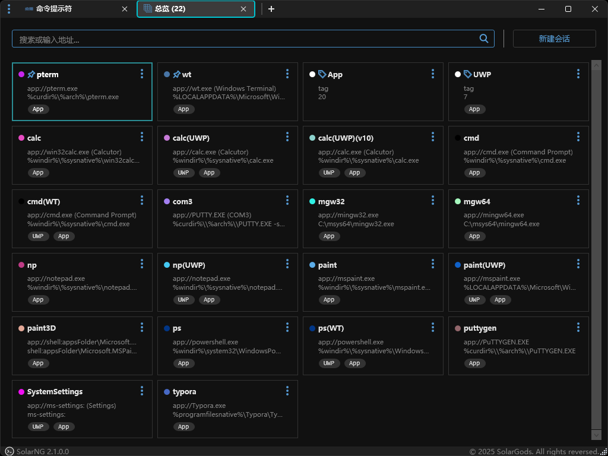

# SolarNG

SolarNG是一个浏览器界面风格的远程管理客户端，还支持标签页化的本地应用管理以及本地应用启动和控制。

## 特色功能

- 支持多协议(SSH/TELNET/FTP/SFTP/SCP/RDP/VNC)客户端和会话管理
- 支持多级SOCK4/SOCK5/HTTP/SSH代理
- 支持多级标签分组功能
- 支持批量修改会话等配置信息
- 支持本地应用(包括UWP程序)、进程、窗口的标签页化管理(可切换主窗口标题栏、可跳出标签页)
- 支持快捷方式标签页
- 应用启动控制包括支持URI格式、支持多显示器位置指定、支持关闭输入法
- 支持通过命名管道来传递远程客户端的配置文件和口令
- 自有模块总大小不超过2MB

## 更新说明
### 2.1.0.0

- **增加快捷方式标签页(可以直接把快捷方式导入应用会话)**
- 支持启动RDP的RemoteApp和连接时启动应用

- 增加设置、总览、历史、快捷方式、进程和窗口标签页列表总数显示

- 引入自动输入的新方法

- 增加总览、进程和窗口标签页的图标

- 使用矢量图替代所有的png图片

- 改进标题栏的最小化、最大化和关闭按钮

- 改进新建标签页按钮的样式

- 改进设置里的删除功能

- 改进RDP窗口大小(包括全屏等)的设置方式

- 改进快捷键功能(在标签页中打开默认不启用快捷键功能，需要在会话配置中启用快捷键功能)

- 更新log4net组件到2.0.17版本

- 优化了会话查询的响应速度

- 优化了会话保存到文件、导入和导出的性能

- 修复高DPI下计算初始窗口大小不正确的bug

- 修复WinSCP远程目录的支持

- 修复其他bug

更多请看[Changelog](Doc/Changelog.md)。

## 未来计划

- [ ] 支持自定义会话类型和应用

- [ ] 支持基于RDP协议的代理通道

- [ ] 支持在设置界面修改SolarNG.cfg配置

- [ ] 按照标签来批量打开会话或者执行脚本

- [ ] 完善说明手册

## 安装需求

| 组件                               | 版本                                                   |
| ---------------------------------- | ------------------------------------------------------ |
| Windows                            | Windows 7+ (x86/x64)                                   |
| Microsoft **.NET**                 | .NET Framework 4.5+                                    |
| PuTTY.exe                          | PuTTY 0.71+/0.77+(通过命名管道传递口令)                |
| WinSCP.exe(可选：SFTP/SCP/FTP支持) | WinSCP 5.9+/5.14+(代理支持)/6.0+(通过命名管道传递口令) |
| tvnviewer.exe(可选：VNC支持)       | TightVNC  2.0+                                         |
| PlinkX.exe(可选：代理支持)         | PlinkX 0.79+                                           |

更多介绍请看[说明手册](Doc/SolarNG.md)。